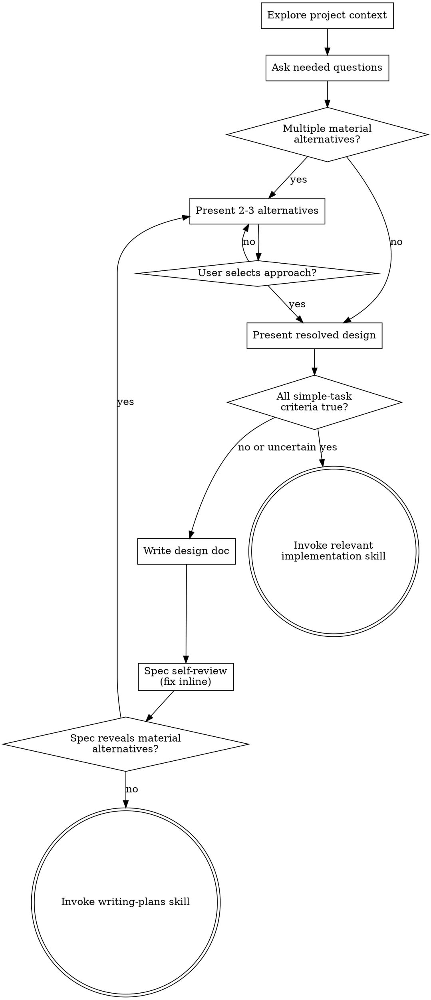

# Brainstorming Ideas Into Designs

Help turn ideas into fully formed designs and specs through natural collaborative dialogue.

Start by understanding the current project context, then ask questions one at a time only when answers affect the design. Once you understand what you're building, present the design and continue into planning or implementation.

<HARD-GATE>
Do NOT invoke any implementation skill, write code, scaffold a project, or take implementation action before presenting a design and resolving consequential choices. Only pause when multiple viable alternatives remain and user selection would materially change the result. Continue without asking for approval once one design is clear.
</HARD-GATE>

## Anti-Pattern: "This Is Too Simple To Need A Design"

Every project goes through this process. A todo list, a single-function utility, a config change — all of them. "Simple" projects are where unexamined assumptions cause the most wasted work. The design can be short (a few sentences for truly simple projects), but you MUST present it before implementation.

## Checklist

You MUST create a task for each of these items and complete them in order:

1. **Explore project context** — check files, docs, recent commits
2. **Ask needed questions** — one at a time; skip questions whose answers do not affect the design
3. **Resolve alternatives** — if multiple viable approaches would materially change the result, present 2-3 with trade-offs and wait for user selection
4. **Present design** — in sections scaled to complexity; continue automatically when no material alternatives remain
5. **Choose artifact path** — simple resolved designs may skip written spec and plan; all others use full path
6. **Full path only: write design doc** — save to `docs/specs/YYYY-MM-DD-<topic>-design.md` and commit
7. **Full path only: spec self-review** — quick inline check for placeholders, contradictions, ambiguity, scope (see below)
8. **Transition automatically** — simple path invokes relevant implementation skill; full path invokes writing-plans immediately after self-review

## Process Flow

**Terminal state depends on artifact path:**
- Simple path: invoke relevant implementation skill directly.
- Full path: invoke writing-plans. Do NOT invoke other implementation skills before planning.

## The Process

**Understanding the idea:**

- Check out the current project state first (files, docs, recent commits)
- Before asking detailed questions, assess scope: if the request describes multiple independent subsystems (e.g., "build a platform with chat, file storage, billing, and analytics"), flag this immediately. Don't spend questions refining details of a project that needs to be decomposed first.
- If the project is too large for a single spec, help the user decompose into sub-projects: what are the independent pieces, how do they relate, what order should they be built? Then brainstorm the first sub-project through the normal design flow. Each sub-project gets its own design → artifact-path decision → implementation cycle.
- For appropriately-scoped projects, ask questions one at a time only when answers could change the design
- Prefer multiple choice questions when possible, but open-ended is fine too
- Only one question per message - if a topic needs more exploration, break it into multiple questions
- Focus on understanding: purpose, constraints, success criteria
- Do not ask for confirmation of information already supplied or discoverable from project context

**Exploring approaches:**

- Do not manufacture alternatives. If one approach clearly fits, state it in the design and continue.
- When multiple viable approaches would materially change behavior, architecture, cost, risk, or UX, present 2-3 options with trade-offs and a recommendation
- Wait for user selection only in that multiple-alternative case

**Presenting the design:**

- Once you believe you understand what you're building, present the design
- Scale each section to its complexity: a few sentences if straightforward, up to 200-300 words if nuanced
- Cover: architecture, components, data flow, error handling, testing
- Continue into the appropriate artifact path without a routine approval question
- If the user interrupts with changes, revise the design before continuing

**Design for isolation and clarity:**

- Break the system into smaller units that each have one clear purpose, communicate through well-defined interfaces, and can be understood and tested independently
- For each unit, you should be able to answer: what does it do, how do you use it, and what does it depend on?
- Can someone understand what a unit does without reading its internals? Can you change the internals without breaking consumers? If not, the boundaries need work.
- Smaller, well-bounded units are also easier for you to work with - you reason better about code you can hold in context at once, and your edits are more reliable when files are focused. When a file grows large, that's often a signal that it's doing too much.

**Working in existing codebases:**

- Explore the current structure before proposing changes. Follow existing patterns.
- Where existing code has problems that affect the work (e.g., a file that's grown too large, unclear boundaries, tangled responsibilities), include targeted improvements as part of the design - the way a good developer improves code they're working in.
- Don't propose unrelated refactoring. Stay focused on what serves the current goal.

## After the Design

**Choosing artifact path:**

All simple-task criteria must be true:
- Scope is narrow, clear, and self-contained
- Change is low-risk and easy to reverse
- No architecture decisions, cross-system contracts, data migrations, security concerns, or irreversible actions
- Implementation steps are obvious from the resolved design

If any criterion is false or uncertain, use the full spec path.

For simple path:
- Skip the written spec and implementation plan
- Invoke the relevant implementation skill directly
- Preserve the presented design as implementation contract

For full path, continue with documentation and planning below.

**Documentation:**

- Write the validated design (spec) to `docs/specs/YYYY-MM-DD-<topic>-design.md`
  - (User preferences for spec location override this default)
- Use elements-of-style:writing-clearly-and-concisely skill if available
- Commit the design document to git

**Spec Self-Review:**
After writing the spec document, look at it with fresh eyes:

1. **Placeholder scan:** Any "TBD", "TODO", incomplete sections, or vague requirements? Fix them.
2. **Internal consistency:** Do any sections contradict each other? Does the architecture match the feature descriptions?
3. **Scope check:** Is this focused enough for a single implementation plan, or does it need decomposition?
4. **Ambiguity check:** Could any requirement be interpreted two different ways? If context makes one interpretation clearly fit, make it explicit. If multiple material interpretations remain, return to the alternatives step and wait for user selection.

Fix any issues inline. No need to re-review — just fix and move on.

**Automatic Transition:**
After the spec review loop passes, announce the spec path. Invoke writing-plans immediately after self-review. Do not ask for spec approval. Any multiple viable alternatives should have been resolved before writing the spec.

**Implementation:**

- Simple path: invoke relevant implementation skill directly
- Full path: invoke writing-plans to create a detailed implementation plan; do not invoke another implementation skill first

## Quick Reference

| Situation | Next action |
|---|---|
| One clear design | Present it, then continue automatically |
| Multiple viable alternatives with material trade-offs | Recommend one, present options, wait for user selection |
| Simple resolved design | Skip spec and plan; invoke implementation skill |
| Full spec self-reviewed | Invoke writing-plans without another approval gate |
| User changes requirements mid-flow | Revise affected design before continuing |

## Common Mistakes

- Asking "Does this look right?" after each section when no choice remains
- Inventing alternatives to satisfy a quota
- Treating spec review as user approval instead of an internal quality check
- Continuing while consequential alternatives remain unresolved

## Visual Companion

Visual companion is opt-in only. Use it only when the user explicitly asks for it.

Do not offer it, suggest it, or ask whether they want to use it. Default brainstorming is text-only, even for UI, layout, diagram, or other visual topics.

If the user explicitly asks for visual companion support, read the detailed guide before proceeding:
`skills/brainstorming/visual-companion.md`

After an explicit request, decide FOR EACH QUESTION whether to use the browser or the terminal. The test: **would the user understand this better by seeing it than reading it?**

- **Use the browser** for content that IS visual — mockups, wireframes, layout comparisons, architecture diagrams, side-by-side visual designs
- **Use the terminal** for content that is text — requirements questions, conceptual choices, tradeoff lists, A/B/C/D text options, scope decisions

A question about a UI topic is not automatically a visual question. "What does personality mean in this context?" is a conceptual question — use the terminal. "Which wizard layout works better?" is a visual question — use the browser.
